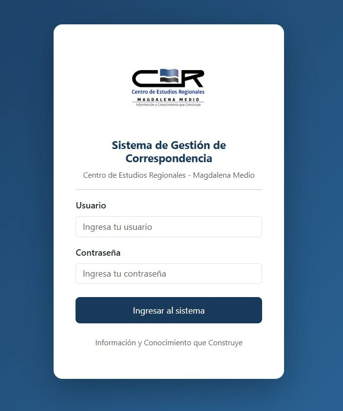
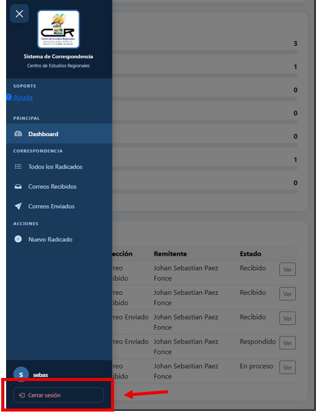

# Acceso al sistema

## Cómo iniciar sesión

1. Abre tu navegador (Chrome, Edge o Firefox actualizado).
2. Ingresa la dirección del sistema — el administrador te la proporcionará.
3. Escribe tu **nombre de usuario** y **contraseña**.
4. Haz clic en **Ingresar al sistema**.

---

## ¿No puedes entrar?

Verifica estos puntos antes de llamar al administrador:

!!! warning "Revisa esto primero"

- ¿El nombre de usuario tiene mayúsculas o espacios? El sistema distingue mayúsculas.
- ¿Tienes **Bloq Mayús** activado al escribir la contraseña?
- ¿Estás conectado a la red institucional del CER?.

Si el problema persiste, contacta al administrador para restablecer tu contraseña.

---

## Cómo cerrar sesión

1. En el menú lateral izquierdo, busca la opción **Cerrar sesión** (parte inferior).
2. Haz clic — el sistema te redirige a la pantalla de inicio.

!!! danger "Importante en equipos compartidos"
Si no cierras sesión manualmente, **permanecerá activa por 14 días**. En equipos compartidos esto representa un riesgo de acceso no autorizado. Cierra sesión siempre al terminar.
