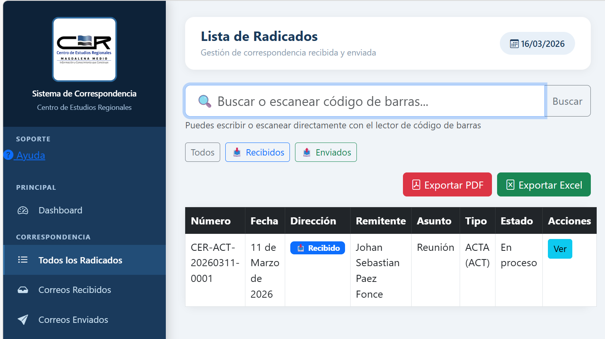
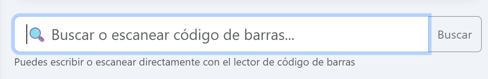
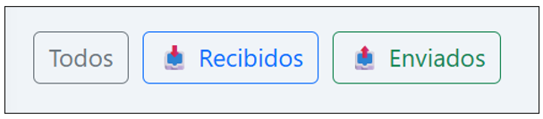
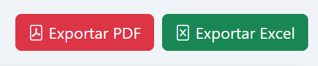

# Buscar y filtrar radicados

Accede desde el menú con la opción **Todos los Radicados**.

## Buscar un radicado

Usa la **barra de búsqueda superior** para localizar por:

- Número de radicado
- Nombre del remitente
- Asunto

!!! tip "Lector de código de barras"
Conecta un lector USB, posiciona el cursor en la barra de búsqueda y escanea la etiqueta del documento físico. El sistema lo localiza instantáneamente.

---

## Filtrar por tipo

Usa los botones de filtro para segmentar la vista:

| Botón         | Muestra                 |
| ------------- | ----------------------- |
| **Todos**     | Toda la correspondencia |
| **Recibidos** | Solo correos recibidos  |
| **Enviados**  | Solo correos enviados   |

---

## Exportar el listado

| Botón              | Resultado                   |
| ------------------ | --------------------------- |
| **Exportar PDF**   | Listado listo para imprimir |
| **Exportar Excel** | Archivo .xlsx para análisis |

!!! warning "Limitación actual"
La exportación descarga **siempre el listado completo**, sin importar el filtro activo. Si necesitas solo Recibidos o Enviados, filtra manualmente el archivo descargado en Excel. Esta limitación se mejorará en versiones futuras.
