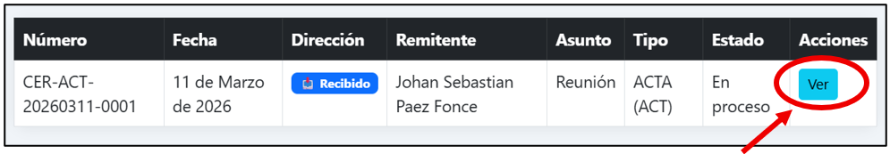
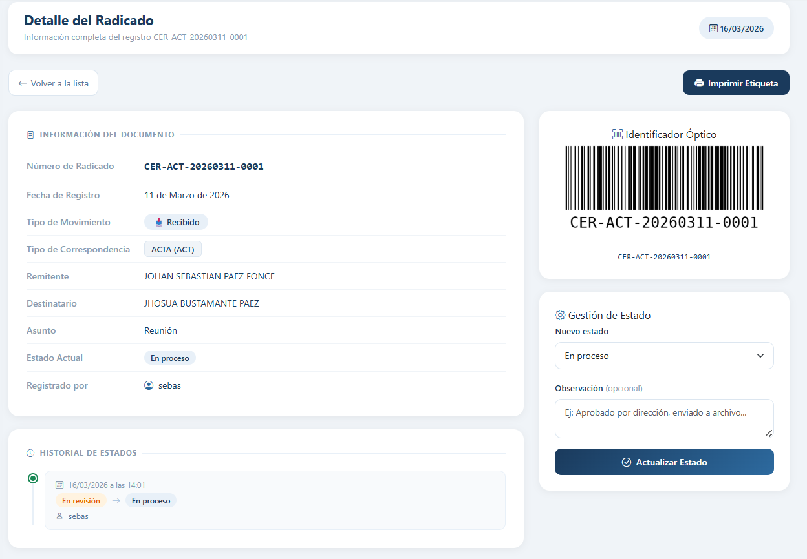
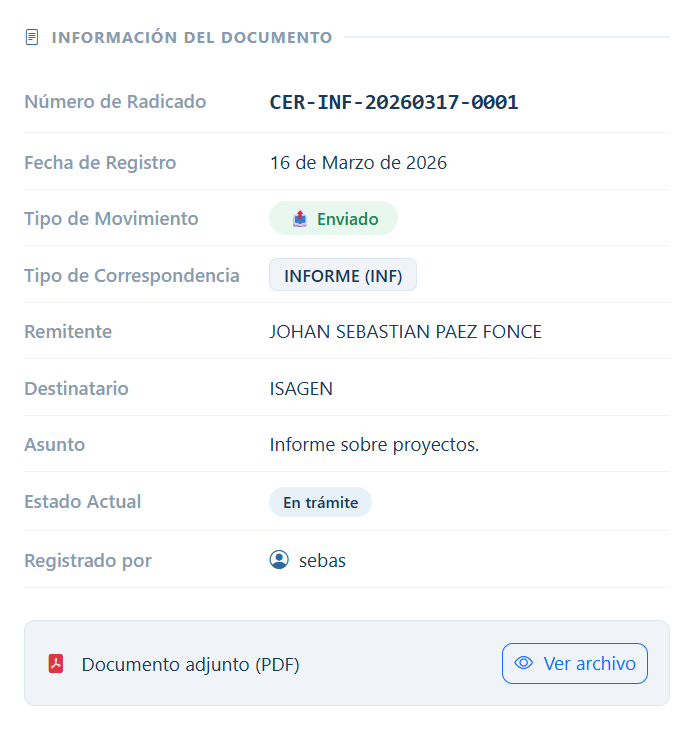
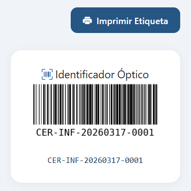
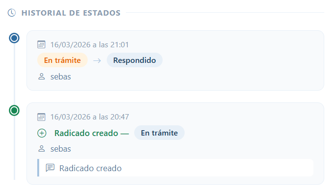

# Ver detalle de un radicado

Haz clic en **Ver** desde la lista de radicados o desde el Dashboard.

## ¿Qué encuentras en el detalle?

### Panel izquierdo — Ficha del documento

- Número de radicado
- Fecha de registro
- Tipo de movimiento y tipo de correspondencia
- Remitente, destinatario y asunto
- Estado actual y usuario que lo registró
- Enlace al PDF adjunto (si tiene)

---

### Panel superior derecho — Código de barras

Código generado automáticamente. Escanéalo con un lector USB desde la lista de radicados para ubicar el documento al instante.

---

### Panel inferior derecho — Gestión de estado

Disponible solo para **Administrador** u **Operador**. Desde aquí cambias el estado del radicado. Ver [Cambiar estado de un radicado](estados.md).

---

### Parte inferior — Historial de estados

Registro cronológico de todos los cambios de estado. Es de **solo lectura** — no puede modificarse ni eliminarse.

!!! tip "¿Para qué sirve el historial?"
Permite a directivos y auditores conocer con exactitud el recorrido del documento:

- Quién lo recibió.
- Quién lo procesó.
- Fecha y hora de cambió de estados.
- Observaciones registradas en cada etapa.

