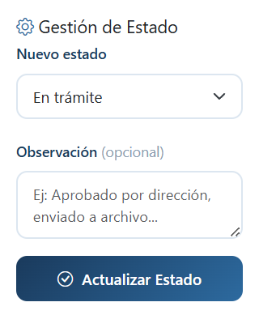
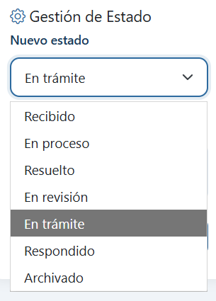

# Cambiar estado de un radicado

!!! warning "Quién puede hacer esto"
Solo usuarios con rol **Administrador** u **Operador**.

## Pasos

1. Abre el **detalle del radicado**.
2. En el panel inferior derecho, busca **Gestión de Estado**.
3. En **Nuevo estado**, selecciona el estado al que deseas mover el radicado.
4. En **Observación** (opcional), escribe una nota que explique el cambio. Ejemplo: _"Documento enviado a revisión por la dirección"_.
5. Haz clic en **Actualizar Estado**.

El sistema guarda el cambio, actualiza la ficha y registra una nueva entrada en el historial automáticamente.

---

## Estados disponibles

| Estado          | Significado                    |
| --------------- | ------------------------------ |
| **Recibido**    | Documento ingresado al sistema |
| **En revisión** | En proceso de evaluación       |
| **En trámite**  | Siendo gestionado              |
| **En proceso**  | En ejecución                   |
| **Respondido**  | Se emitió respuesta            |
| **Resuelto**    | Proceso concluido              |
| **Archivado**   | Documento cerrado y archivado  |

!!! tip "Sin cambio, sin registro"
Si seleccionas el mismo estado actual, el sistema no generará una nueva entrada en el historial.

