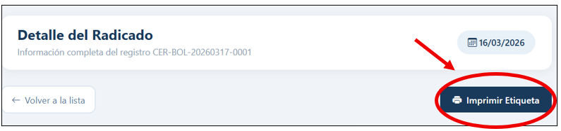
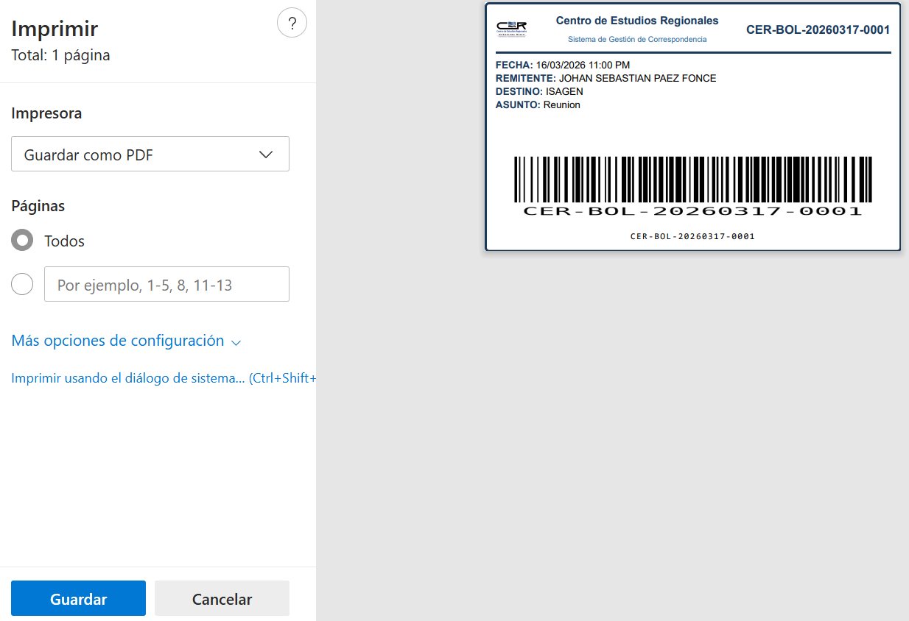
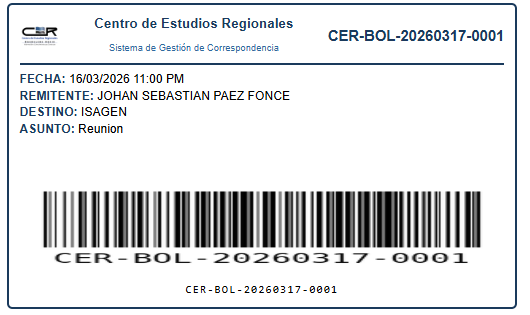

# Imprimir etiqueta (sticker)

La etiqueta vincula el documento físico con su registro digital mediante el código de barras.

## Cómo imprimir

1. Abre el **detalle del radicado**.
2. Haz clic en **Imprimir Etiqueta** (parte superior derecha).

3. Se abre la vista de impresión del navegador.

4. Selecciona tu impresora o elige **Guardar como PDF**.
5. Recorta la etiqueta y pégala en el documento físico.

---

## ¿Qué contiene la etiqueta?

- Logotipo y nombre de la Corporación CER
- Número de radicado
- Fecha de registro, remitente, destinatario y asunto
- Código de barras para identificación óptica

!!! tip "Antes de pegar"
Verifica que el código de barras sea legible escaneándolo antes de adherirlo al documento.
