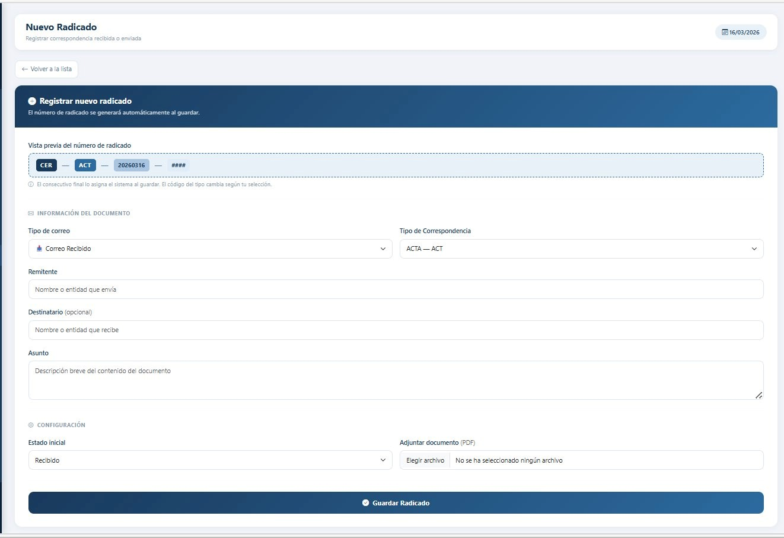
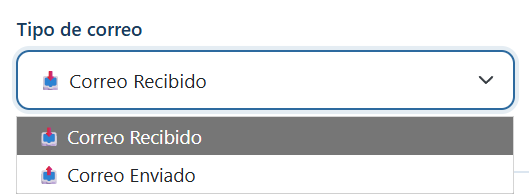
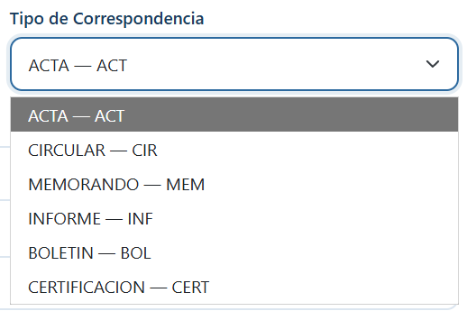
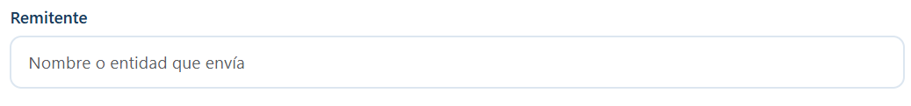
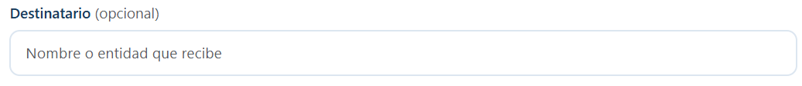
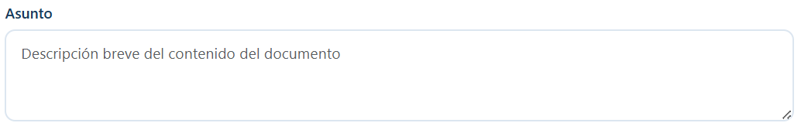
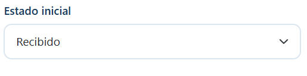
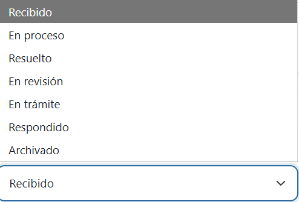
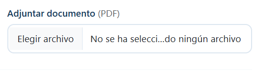

# Registrar un nuevo radicado

!!! warning "Quién puede hacer esto"
Solo usuarios con rol **Administrador** u **Operador**.

En el menú lateral, haz clic en **Nuevo Radicado**. Verás el siguiente formulario:

## Pasos

**Paso 1 — Selecciona el tipo de correo**

Elige entre **Correo Recibido** o **Correo Enviado**.

---

**Paso 2 — Selecciona el tipo de correspondencia**

Opciones disponibles: ACTA, CIRCULAR, MEMORANDO, INFORME, BOLETIN, CERTIFICACION, entre otros.

---

**Paso 3 — Ingresa el remitente**

Escribe el nombre de la persona o entidad que envía el documento.

---

**Paso 4 — Ingresa el destinatario (opcional)**

## Sobre el destinatario

| Tipo de correo  | ¿Quién es el destinatario?                              |
| --------------- | ------------------------------------------------------- |
| Correo Recibido | La dependencia o funcionario interno al que va dirigido |
| Correo Enviado  | La entidad o persona externa a quien se dirige          |

---

**Paso 5 — Escribe el asunto**

Descripción breve del contenido del documento.

---

**Paso 6 — Selecciona el estado inicial**

El estado inicial recomendado para documentos nuevos es **Recibido**.

---

**Paso 7 — Adjunta el documento PDF (opcional)**

Si tienes el documento escaneado, adjúntalo aquí. Solo se aceptan archivos en formato **PDF**.

---

**Paso 8 — Guarda el radicado**

Haz clic en **Guardar Radicado**. El sistema asignará el número y generará el código de barras automáticamente.

---

## Formato del número de radicado

CER-[TIPO]-[AAAAMMDD]-####

**Ejemplo:** `CER-OF-20260311-0001` → Oficio del 11 de marzo de 2026, primer radicado del día.

!!! tip "El número es automático"
No puedes modificarlo manualmente. El sistema lo genera para garantizar unicidad e integridad.
